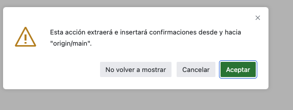

# Programación II 2024_2025 - GrIA/USC

Bienvenidos al comienzo de las prácticas de la asingaturas de Programación II del GrIA!

Estas prácticas constarán de 12 sesiones de 2,5h cada una, donde aprenderás:

0. A usar GitHub classrom y hacer debugging con python - 1 Sesión.
1. A entender y poner en práctica la programación funcional - 2 Sesiones. 
2. A comprender qué es la programación orientada a objetos (POO), para qué se usa y cómo se implementa en python - 3 Sesiones.
3. Nuevas estructuras de datos más complejas como las listas enzaladas, colas o las pilas, usando POO - 3 Sesiones.
4. A implementar estructuras de datos no lineales, como lo árboles (binarios), así como a conocer su estructura interna - 2/3 Sesiones. 

### Calendario de las clases
Esta es la distribución de las clases, busca tu grupo y apúntalo:

- Grupo 1 (Martes): IA-1.3
- Grupo 2 (Lunes): IA-1.1
- Grupo 3 (Miércoles): IA-1.3 
<div align="center">

| Sesión | Lab         | Grupo 1         | Grupo 2        | Grupo 3            |
|:------:|:-----------:|:---------------:|:--------------:|:------------------:|
| 1      | Lab0        | Martes 4 Feb    | Lunes 3 Feb    | Miércoles 5 Feb    |
| 2      | Lab1        | Martes 11 Feb   | Lunes 10 Feb   | Miércoles 12 Feb   |
| 3      | Lab1        | Martes 18 Feb   | Lunes 17 Feb   | Miércoles 19 Feb   |
| 4      | Lab2        | Martes 25 Feb   | Lunes 24 Feb   | Miércoles 26 Feb   |
| 5      | Lab2        | Martes 11 Marzo | Lunes 10 Marzo | Miércoles 12 Marzo |
| 6      | Lab2        | Martes 18 Marzo | Lunes 17 Marzo | Miércoles 19 Marzo |
| 7      | Lab3        | Martes 25 Marzo | Lunes 24 Marzo | Miércoles 26 Marzo |
| 8      | Lab3        | Martes 1 Abril  | Lunes 31 Marzo | Miércoles 2 Abril  |
| 9      | Lab3        | Martes 8 Abril  | Lunes 7 Abril  | Miércoles 9 Abril  |
| 10     | Lab4        | Martes 22 Abril | Lunes 21 Abril | Miércoles 23 Abril |
| 11     | Lab4        | Martes 29 Abril | Lunes 28 Abril | Miércoles 30 Abril |
| 12     | Lab4/Repaso | Martes 6 Mayo   | Lunes 5 Mayo   | Miércoles 7 Mayo   |

</div>

**NOTA**: Cuidado! La semana de carnaval (3-7 de Marzo) no hay clase para ningún grupo ;-)


### Fechas de entrega de las prácticas
Te dejo también por aquí las fechas de las entregas de prácticas (ten en cuenta que la entrega se hará a través de Github, no por el CV):

<div align="center">

| LAB | Grupo 1         | Grupo 2        | Grupo 3             |
|:--------:|:---------------:|:--------------:|:-------------------:|
| LAB1       | Martes 25 Feb   | Lunes 24 Feb   | Miércoles 26 Feb    |
| LAB2       | Martes 25 Marzo | Lunes 24 Marzo | Miércoles 26 Marzo  |
| LAB3       | Martes 22 Abril | Lunes 21 Abril | Miércoles 23 Abril  |
| LAB4       | Martes 6 Mayo   | Lunes 5 Mayo   | Martes 7 Mayo       |

</div>

## Comienzo de las prácticas: ¿qué tengo que hacer?

### Github Classroom

GitHub es un repositorio en la nube de código que sirve para gestionar y publicar software (libre o privado) y manejar el ciclo de vida de tus desarrollos. Muchas de las librerias o modelos de IA (por no decir todos) están subidos a esta plataforma y te aseguro que vas a hacer un uso de ella muy intensivo. 

Además, es una organización preocupada por la educación y formación, y nos ofrece el servicio GitHub Classroom para aprender a programar de forma más sencilla para todos. 

Por lo tanto, **lo primero de todo es hacerte una cuenta en [GitHub](https://github.com/), que vas a necesitar para la realización de las prácticas**. Recomendaciones:
- Utiliza tu nombre real para el usuario: tu nombre y el primer apellido unidos con un punto sería la mejor opción (p. ej. yo sería david.chaves*).
- Pon una foto, ya que sois muchos y así me facilitarás tu identificación.

*Aunque en realidad mi username es [`dachafra`](https://github.com/dachafra)

### ¿Dónde encuentro las prácticas?

En la siguiente tabla puedes encontrar el enlace a cada una de las prácticas que debes realizar en la asignatura. La tabla se irá actualizando a medida que vayamos avanzando el curso con el enlace de la siguiente práctica. 
<div align="center">

| LAB | Grupo 1         | Grupo 2        | Grupo 3             |
|:--------:|:---------------:|:--------------:|:-------------------:|
| LAB0       |  https://classroom.github.com/a/4DnUScH7 | https://classroom.github.com/a/4DnUScH7 | https://classroom.github.com/a/4DnUScH7 |
| LAB1       |  | | |
| LAB2       |  | | |
| LAB3       |  | | |
| LAB4       |  | | |

</div>

### ¿Cómo empiezo una práctica?

Vamos a usar de ejemplo nuestro particular "Hello World" Programing II Edition. Haz click en el siguiente enlace para empezar: https://classroom.github.com/a/nyY1WeVP 

Lo primero que debemos hacer es seleccionar nuestro nombre entre la lista. **Mucho cuidado, ya que está parte solo la haremos una sola vez!**

<p align="center">
  
</p>


A continuación se nos mostrará una imagen para aceptar la tarea, simplemente hacemos click en "Accept this assignment"


<p align="center">
  
</p>


Y nos deberá aparecer un mensaje como el siguiente diciendo que se ha creado el repositorio correctamente y un enlace. 
**Hacemos click en el enlace que nos aparece, siempre empezará por "http://github.com/usc-gria". No hacemos click en "Open in Github Codespaces"**

<p align="center">
  
</p>


Una vez hacemos click, nos deberá salir una pantalla como la siguiente y este será nuestro repositorio para la práctica. Guárdate el enlace (yo te recomiendo un bookmark en el navegador).

<p align="center">
  
</p>


### Lanzar nuestro proyecto y empezar a programar

Antes de comenzar a realizar las prácticas, nos queda el último paso. Ahora debemos lanzar el entorno de desarrollo integrado (IDE) para la programación. Gracias a GitHub Classroom no vamos a tener que instalar nada y haremos las prácticas a través del navegador. Si quieres una configuración más avanzada, instalando todo en tu ordenador, habla conmigo que estaré encantado de ayudarte en la puesta a punto, pero no es necesario para realizar estás prácticas. 

Únicamente debemos hacer click, ahora si, en `Open in Github Codespaces` y se nos abrirá una instancia de Visual Studio Code en el navegador. 

<p align="center">
  
</p>


Ahora nos vamos al código, todas las prácticas tendrán al menos un primer archivo llamado `main.py` en la carpeta `src`. ¡Ten cuidado!, solo vas a poder hacer cambios dentro de la carpeta `src`, modificando archivos o creando nuevos, si tocas o cambias o creas algún otro archivo, la práctica podría quedar invalidada.

Una vez abierto el archivo `main.py` nos saldrá un mensaje como el que se muestra a continuación para instalar `python`. Lo instalamos y nos aparecerá instalado correctamente. 

<p align="center">
  
</p>
<p align="center">
  
</p>

Volvemos al explorador, arriba a la izquierda. Ahora si, ya nos aparecerá un botón de ejecución arriba a la derecha con la flecha orientada a la izquierda. Prueba a lanzarlo y te deberá salir el mensaje correspondiente por la terminal.

<p align="center">
  
</p>


### Guardar los cambios y entregar la práctica

**NOTA**: Este proceso que vamos a ver ahora se puede ejecutar siempre que quieras, para asegurar que tus cambios se guardan. Una buena práctica sería lanzar este proceso cada vez que termines una funcionalidad de la práctica, no hace falta tenerla completa para subirlo. Eso si, acuérdate de hacerlo siempre que termines una sesión (ya sea en clase o por tu cuenta) o vayas a apagar el ordenador o cerrar el navegador. 

Solo nos queda el último paso, vamos a ver como guardar y/o entregar las prácticas. Vamos a hacer un pequeño cambio en nuestro `hello-world` project, añadiendo por ejemplo una línea más de código con otro `print`. Una vez realizado el cambio vemos que ha aparecido un 1 en azul en el tercer icono de la izquierda.

<p align="center">
  
</p>


Hacemos click en ese icono y nos aparecerá la siguiente pantalla para cargar tus cambios en el repositorio (y que así yo pueda revisarlo). 

<p align="center">
  
</p>

Añadimos un mensaje, ¡cuidado, no le des a `Confirmación` antes de añadir el mensaje!. Si haces eso, el sistema se quedará "pillado" y tendrás que recargar la página. Añadimos un mensaje y hacemos click en `Confirmación` y se nos mostrará un mensaje de precaución, podemos hacer click en `Si` o en `Siempre` para que no nos vuelva a aparecer el mensaje.

<p align="center">
  
</p>

Por último, debemos sincronizar los cambios. Hacemos click en `Sincronizar cambios 1` (no metemos un mensaje nuevo) y aceptamos el mensaje de warning que nos aparece (en `Aceptar` o en `No volver a mostrar`). 

<p align="center">
  
  
</p>

### Guardar los cambios y entregar la práctica (avanzado)

Si prefieres usar la terminal en vez de la interfaz gráfica, puedes utilizar los siguientes comandos:

```bash
git add .
git commit -m "AQUI PONES UN MENSAJE"
git push
```
<p align="center">
  
</p>

Y listo, tendrás los cambios subidos a tu repositorio. No te preocupes por entender los comandos, lo aprenderás en la asignatura de Ingeniería del Software en 2º Curso.


### Comprobando que mis cambios se han subido al repositorio

Volvemos a nuestro repositorio en GitHub y podemos comprobar que se han subido correctamente nuestros cambios de dos formas diferentes. La primera en la página principal del repositorio viendo que aparece el mensaje que añadimos en el Visual Studio Code. La segunda sería yéndonos directamente al archivo que hemos modificado (en nuestro caso `src/main.py`) y observando que la linea que añadimos está ahí.

<p align="center">
  
  
</p>


## Gestión de las prácticas en mi ordenador (uso avanzado).

Puedes usar [GitHub Desktop](https://desktop.github.com/download/) y cualquier IDE que de soporte a Python ([PyCharm](https://www.jetbrains.com/es-es/pycharm/download/) o Visual Studio Code). Si quieres hacerlo de esta manera y tienes dudas, ponte en contacto conmigo.